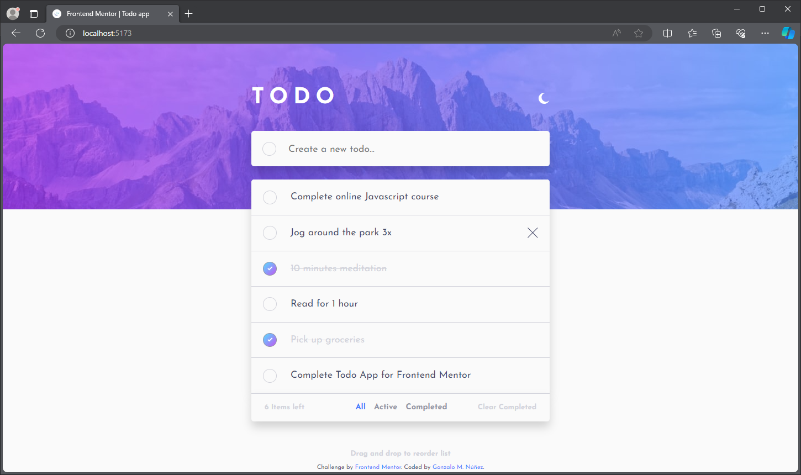
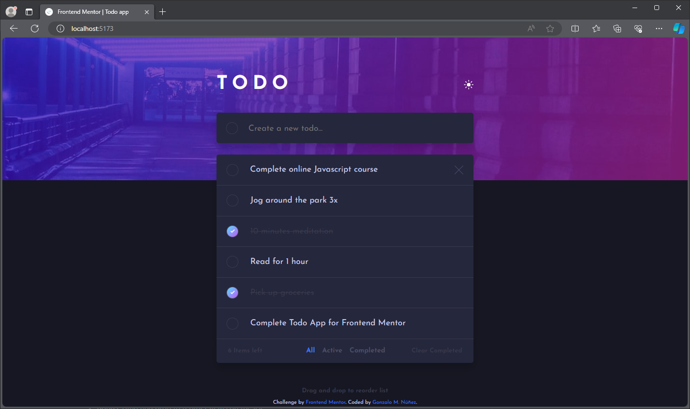
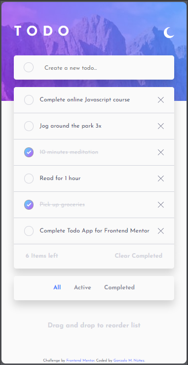
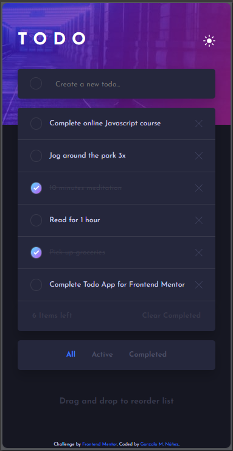

# Frontend Mentor - Todo app solution

This is a solution to the [Todo app challenge on Frontend Mentor](https://www.frontendmentor.io/challenges/todo-app-Su1_KokOW). Frontend Mentor challenges help you improve your coding skills by building realistic projects. 

## Table of contents

- [Overview](#overview)
  - [The challenge](#the-challenge)
  - [Screenshot](#screenshot)
  - [Links](#links)
- [My process](#my-process)
  - [Built with](#built-with)
  - [What I learned](#what-i-learned)
  - [Continued development](#continued-development)
  - [Useful resources](#useful-resources)
- [Author](#author)
- [Acknowledgments](#acknowledgments)

## Overview

The classic todo app with a few twists! This app includes a dark/light theme toggle and drag & drop reordering for anyone wanting an extra test.

### The challenge

Users should be able to:

- View the optimal layout for the app depending on their device's screen size
- See hover states for all interactive elements on the page
- Add new todos to the list
- Mark todos as complete
- Delete todos from the list
- Filter by all/active/complete todos
- Clear all completed todos
- Toggle light and dark mode
- **Bonus**: Drag and drop to reorder items on the list

### Screenshot

### Links

- Solution URL: [Add solution URL here](https://github.com/gnunez0101/todo-app)
- Live Site URL: [Add live site URL here](https://your-live-site-url.com)

## My process

My process began with making all layouts with HTML, then, working from top to bottom with styling for mobile layout first. I used CSS Flexbox most of the time and CSS Grid to lay out the root element only. I styled every element statically just for laying out the UI, taking the sizes from the example images provided. After that, I automated the adding and removing of list elements with React.JS, using states and hooks. Most of the work for managing the items was performed by the useReduce hook. It served me as a very good practice since I just learned to use this hook recently. It's not easy at the beginning but is a different and elegant approach to managing states. Then, I added the check buttons and the X's for removing the elements. The next step was to add the filters and menus at the bottom. More work for the same useReducer hook. After all elements were fully functional I began working on the drag & drop bonus feature. It was challenging because you had to use several events on the items to manage it. After some trials I make it work properly the simpler way possible. I considered using libraries such as React-DnD and react-beautiful-dnd for this task since they allow sophisticated animations and transitions, but they have learning curves not on the scope of this challenge. Maybe in my next similar challenge, I will use one. Once I had drag and drop working I continued with the darkmode/lightmode toggle. It was a very nice learning lesson with CSS and custom properties for this. Finally, I finished styling everything for the desktop screen. The main challenge of this was to scale everything to a bigger font size. In the end it was a lot of fun and new lessons learned on this wonderful challenge.

### Built with

- Semantic HTML5 markup
- CSS custom properties
- Flexbox
- CSS Grid
- Mobile-first workflow
- [React](https://react.dev/) - JS library
- [PicPick](https://picpick.app/en/) - Very useful tools for web development tasks, like measuring of pixels with a useful ruler for images and a very nice color picker.
- VS Code editor

### What I learned

On this challenge I learned:
- More on screen resize behaviors with @media queries on CSS.
- A lot of React's useReducer hook for managing states.
- To add darkmode toggle functionality to page with CSS and Javascript.
- To implement Drag and Drop on React.js.

### Useful resources

- [PicPick](https://picpick.app/en/) - Very useful tools for web development tasks, like measuring of pixels with a useful ruler for images and a very nice color picker.

## Author

- LinkedIn - [Gonzalo Manuel Núñez](https://www.linkedin.com/in/gnunez0101)
- Frontend Mentor - [@gnunez0101](https://www.frontendmentor.io/profile/gnunez0101)